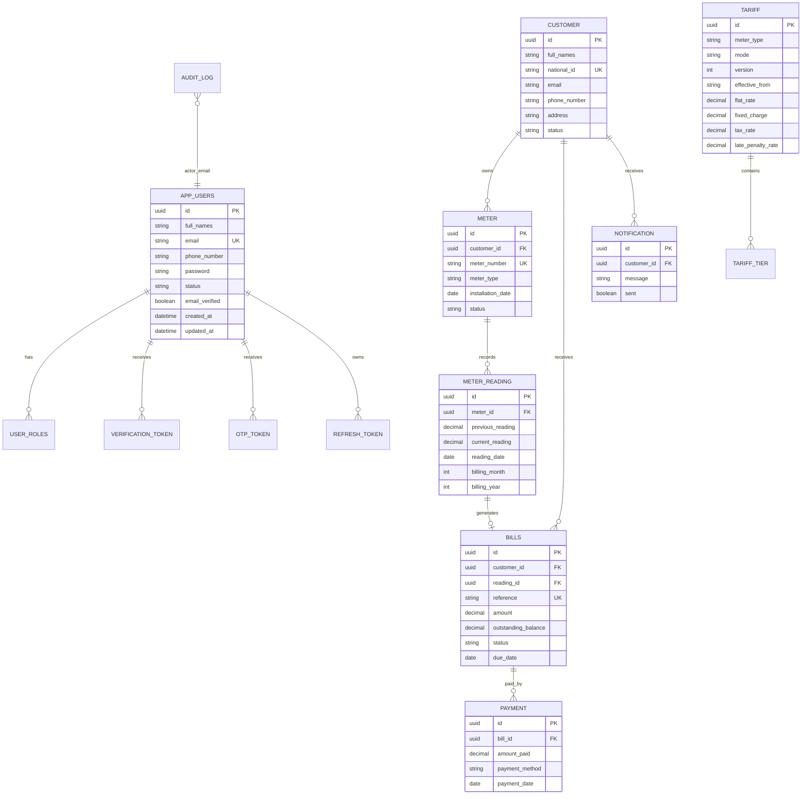

# Utility Billing System ERD

Relational DBMS target: H2 for local development, PostgreSQL-compatible schema style for production.

Important constraints:

- `app_users.email`, `customer.national_id`, and `meter.meter_number` are unique.
- `meter_reading` has one reading per meter per `billing_month` and `billing_year`.
- Tariffs are versioned and new records must start from a future billing cycle.
- `data.sql` configures an H2 database trigger named `trg_bill_notification` that inserts a notification after a bill row is generated.
