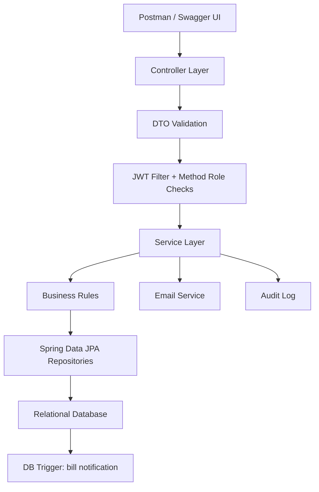
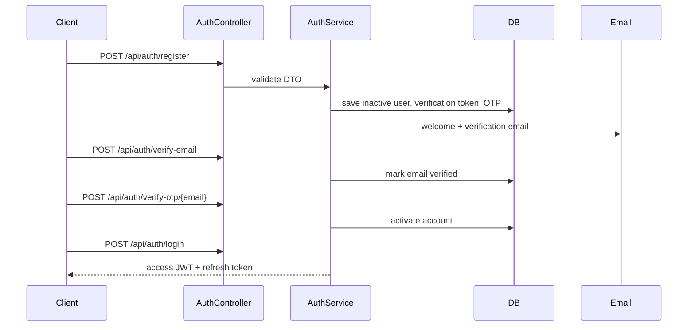
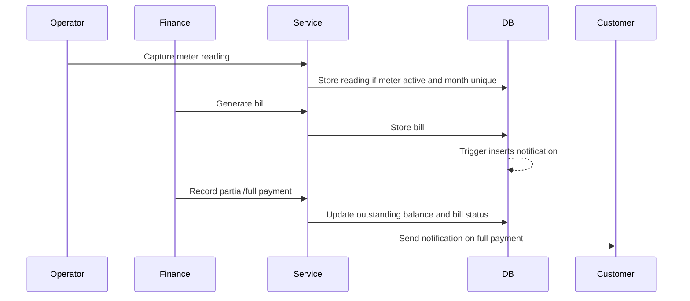

# Spring Boot Flow Diagram



Authentication flow:



Billing flow:



Role access summary:

- `ROLE_ADMIN`: manage users, customers, meters, tariffs, bill approvals.
- `ROLE_OPERATOR`: capture meter readings and view operational customer/meter data.
- `ROLE_FINANCE`: approve bills and record payments.
- `ROLE_CUSTOMER`: view bills, payments, and notifications.

Run:

```powershell
mvn spring-boot:run
```

Swagger UI:

```text
http://localhost:8080/swagger-ui.html
```

Seeded administrator:

```text
email: admin@utility.rw
password: Admin@123!
```
